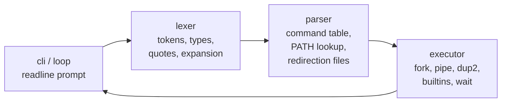

# minishell

A 42 school project: a minimal bash-like shell written in C (C99/POSIX, compiled with `clang`,
linked against GNU `readline`). Developed in a team of two, originally at
[stepanm99/minishell](https://github.com/stepanm99/minishell).

The goal of the project is to re-implement a working subset of `bash` from scratch, using only
low-level system calls (`fork`, `execve`, `pipe`, `dup2`, `wait`, `open`, signals) and without
relying on any existing shell. Code follows the 42 norm (norminette) and is kept leak-free under
valgrind.

## Features

- Interactive prompt with line editing and command history via `readline`.
- Command lookup through `PATH`; absolute and relative paths to executables.
- **Pipelines** of arbitrary length (`cmd1 | cmd2 | cmd3 ...`), each command running in its own
  child process with correctly wired file descriptors.
- **Redirections**: `<` infile, `>` outfile (truncate), `>>` outfile (append), `<<` heredoc with a
  delimiter, including permission and non-existent-file error handling.
- **Quoting**: single quotes (literal) and double quotes (with variable expansion), unpaired quote
  detection and removal of unescaped quotes.
- **Expansion** of environment variables (`$VAR`) and the last exit status (`$?`).
- **Builtins**: `echo` (with `-n`), `cd`, `pwd`, `export`, `unset`, `env`, `exit`, plus a
  project-specific `help`. Builtins work both standalone and inside pipelines/redirections.
- **Signals**: `Ctrl-C` interrupts the running foreground process or clears the prompt, `Ctrl-\`
  is ignored like in bash, `Ctrl-D` exits the shell.
- Exit status propagation (`$?`) for successful commands, failed commands, and non-existent binaries.

## Architecture

The input flows through four stages, each in its own directory under `src/`:



| Directory | Responsibility |
|---|---|
| `src/cli/`, `src/loop.c` | Prompt, `readline` loop, history, dispatching a line to the pipeline |
| `src/lexer/` | Tokenizing the line into a token chain, classifying tokens (command, argument, pipe, redirection, file), quote pairing, trimming, `$` expansion |
| `src/parser/` | Turning the token chain into a command table (`t_cmd_list`), resolving binaries in `PATH`, opening infiles/outfiles, garbage tracking |
| `src/executor/` | Forking children, building the pipe chain, redirecting fds, running builtins, waiting for pids and setting `g_last_status` |
| `src/builtins/` | Implementations of the eight builtins |
| `src/signals/` | `sigaction` handlers for `SIGINT` / `SIGQUIT` |
| `src/utils/` | Minimal libft-style helpers (strings, memory, lists, `itoa`/`atoi`), debug output, freeing |
| `incl/` | `minishell.h` (shared data structures) and `executor.h` |
| `tests/` | GoogleTest unit tests (`unit_tests.cc`, built via `CMakeLists.txt` / `make unittests`) |

Shared state lives in a single `t_data` struct passed through all stages; the only globals are
`g_pid` (currently running child, for the signal handler) and `g_last_status` (`$?`).

## Building and running

```sh
make            # builds ./minishell (clang, -lreadline)
./minishell
make unittests  # GoogleTest suite
make fclean
```

Memory checking with valgrind uses the bundled `readline.supp` to silence known `readline` leaks
(see the Notes section at the bottom).

## Authors and division of work

| Author | Identities in `git log` | Ownership |
|---|---|---|
| **Vojtěch Parkán** (`Czarte`) | `Czarte`, `czarte`, `Vojtěch Parkán`, `voparkan@*.42prague.com` | Executor, parser port, tests, memory hygiene |
| **Štěpán Melichar** (`stepanm99`) | `stepanm99`, `Stepan Melichar`, `smelicha@*.42prague.com` | Lexer, CLI loop, builtins |

### Czarte's part (Vojtěch Parkán)

Czarte built and owned the **execution side** of the shell, plus the test and debugging infrastructure:

- **Executor** – `src/executor/` (`executor.c`, `ft_pipes.c`, `ft_executor.c`), `incl/executor.h`:
  forking, arbitrarily long pipelines, pid tracking and waiting for subprocesses, exit status (`$?`),
  running builtins inside pipelines with redirections.
- **Parser** – `src/parser/ft_command_parser.c`, `get_cmd_path.c`: command parsing ported from his
  pipex project, `PATH` lookup, non-existent command handling, quote removal (`remove_unescaped_quotes`),
  `<` / `>` / `>>` infile/outfile handling and permission errors.
- **Utilities** – `src/utils/file_utils.c`, `executor_helpers.c`, `debug_utils.c` (debug flag output),
  garbage collector / freeing of executor allocations.
- **Tooling** – GoogleTest unit tests (`tests/unit_tests.cc`, `CMakeLists.txt`), clang build setup,
  norminette passes, `readline.supp` valgrind suppressions, README.

Timeline (2024): Apr–Jun tooling and unit tests → Jul executor and piping → Aug hardening and parser port
→ Sep builtins in pipelines, redirections, exit status → Oct–Nov quote and edge-case fixes.

### Stepan's part (stepanm99)

- **Lexer** – `src/lexer/` (tokenizer, token types, analyzer).
- **CLI / main loop** – `src/cli/cli.c`, `src/loop.c`, `src/data.c`.
- **Builtins** – `src/builtins/` (`export`, `unset`, `cd`, `env`, ...).

## Notes

Flowchart / documentation: https://drive.google.com/file/d/1Jm3Dao2GkvsnJDgX9gBWmau3-ba3Bm-G/view?usp=sharing

readline suppression command:
`valgrind --leak-check=full --show-leak-kinds=all --track-origins=yes --suppressions=readline.supp -s --log-file=logfile.log ./minishell`

show new leaks and suppress already suppressed:
`valgrind --leak-check=full --show-reachable=yes --error-limit=no --gen-suppressions=all --suppressions=readline.supp ./minishell`
